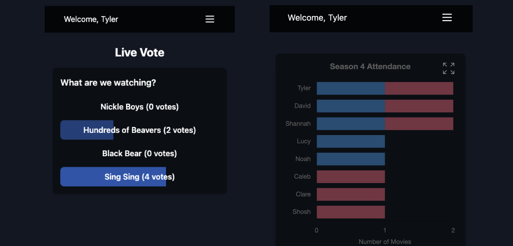

# Movie Club


## Table of Contents

1. [Project Overview](#project-overview)
2. [Features](#features)
3. [Setup and Installation](#setup-and-installation)
4. [Usage](#usage)
5. [Contributing](#contributing)
6. [License](#license)
7. [Contact](#contact)

---

## Project Overview

**Movie Club** is a community-driven platform where users can discover, discuss, and rate movies. It aims to
bring together film enthusiasts of all levels, allowing them to set up groups to facilitate in-person film viewings, 
discussion, and reviews. 



---

## Features
- **Randomized Member Movie Order**
  When the first club meeting is kicked off, Movie Club automatically generates a random nomination order.

- **Live Selection Voting**  
  When a user is nominating films, Movie Club compiles the nominated movies for a vote, showing real time results.

- **Ratings & Reviews**  
  Share your opinions with star ratings and detailed text reviews for each movie.

- **Watch History**  
  Keep track of movies you've previously watched as a group with full watch and vote history as well as attendance 
  breakdowns. 

- **Responsive UI**  
  Mobile first design enables easy use by anyone on a couch, in the theater, or on the go.

- **User Authentication**  
  Users can log in using email or text based authentication to ensure only club members have access.


---

## Setup and Installation

1. **Clone the Repository**
   ```bash
   git clone https://github.com/YourUserName/Movieclub-Website.git
   cd Movieclub-Website
   
2. **Install Dependencies**
   ```bash
   npm i

3. **Configure Environment Vars**
   ```bash
   VITE_SUPABASE_URL={{supabase_url}}
   VITE_SUPABASE_ANON_KEY={{supabase_anon_key}}
   
4. **Start Frontend**
   ```bash
   npm run dev

---

## Usage

1. Sign Up / Login 
   - Register a new account via the /signup route. 
   - Login through the /login route using your credentials.
 
2. Generate a selection order
   - The club admin can generate a random selection order comprised of the existing movie club member roster.

3. Nominate Films
   - When a user is "up" in the selection order, they will be able to nominate 3-4 films.
   - That user can add their picks in app.

4. Live Vote
   - When the club meets, the nominator can start a live poll. 
   - All present users will be able to vote on their preferred film

5. Watch History
   - After a viewing, the poll will close and be available in the club history page showcasing attendance and 
     previous watches.

---

## Contributing

Contributions are welcome! To contribute:

1. Fork the repository.

2. Create a feature branch:
   ```bash
   git checkout -b feature/my-new-feature

3. Commit your changes:
   ```bash
   git commit -m "Add new feature"
   
4. Push the branch:
   ```bash
   git push origin feature/my-new-feature
   
5. Open a pull request describing your changes.

Please ensure that your contributions include tests and adhere to the project's coding standards.

---

## License

This project is licensed under the MIT License.
```
Permission is hereby granted, free of charge, to any person obtaining a copy of this software and associated documentation files (the “Software”), to deal in the Software without restriction, including without limitation the rights to use, copy, modify, merge, publish, distribute, sublicense, and/or sell copies of the Software, and to permit persons to whom the Software is furnished to do so, subject to the following conditions:

The above copyright notice and this permission notice shall be included in all copies or substantial portions of the Software.

THE SOFTWARE IS PROVIDED “AS IS”, WITHOUT WARRANTY OF ANY KIND, EXPRESS OR IMPLIED, INCLUDING BUT NOT LIMITED TO THE WARRANTIES OF MERCHANTABILITY, FITNESS FOR A PARTICULAR PURPOSE AND NONINFRINGEMENT. IN NO EVENT SHALL THE AUTHORS OR COPYRIGHT HOLDERS BE LIABLE FOR ANY CLAIM, DAMAGES OR OTHER LIABILITY, WHETHER IN AN ACTION OF CONTRACT, TORT OR OTHERWISE, ARISING FROM, OUT OF OR IN CONNECTION WITH THE SOFTWARE OR THE USE OR OTHER DEALINGS IN THE SOFTWARE.
```

---

## Contact

- Project Maintainer: Tyler
- Website: movieclub.com

For questions, issues, or suggestions, please open an issue in the repository or reach out directly.
<!-- PLACEHOLDER for additional images or badges, such as build status or test coverage badges. Example:  -->

